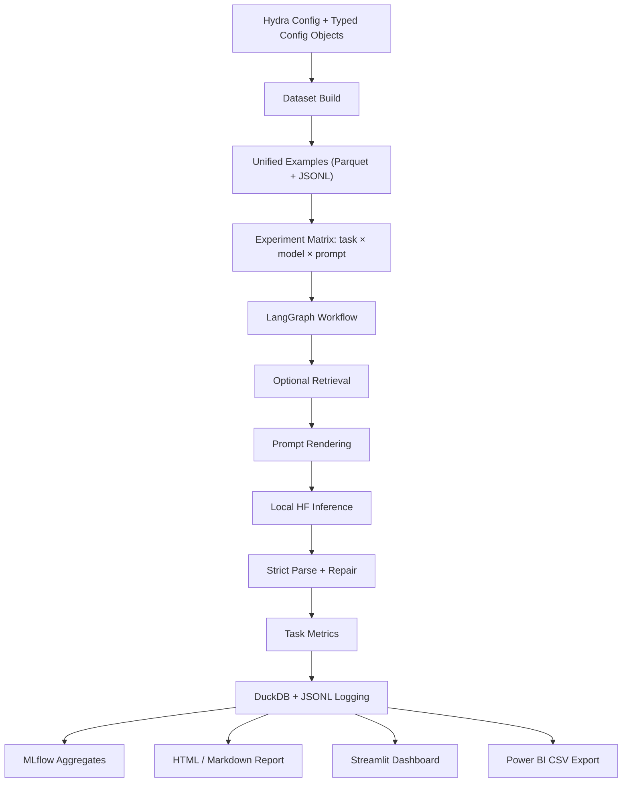

# foundation-model-eval-harness

A config-driven evaluation harness for local Hugging Face foundation models on biomedical-style downstream tasks. The project is built to look and behave like a small internal model evaluation platform rather than a notebook demo: reproducible experiments, typed outputs, per-sample logging, aggregated analytics, automated reports, a lightweight dashboard, and CSV exports for Power BI / Power Platform workflows.

This repository is designed for three audiences at once:

- ML / NLP engineers who need repeatable model comparisons.
- hiring managers / interviewers who want to see an end-to-end evaluation system with operational discipline.
- analytics stakeholders who want clean experiment outputs in DuckDB and CSV rather than raw Python objects.

## Table Of Contents

- [What This Project Solves](#what-this-project-solves)
- [System Overview](#system-overview)
- [Architecture](#architecture)
- [Core Design Decisions](#core-design-decisions)
- [Tasks, Datasets, And Metrics](#tasks-datasets-and-metrics)
- [Repository Layout](#repository-layout)
- [Environment And Dependencies](#environment-and-dependencies)
- [Quickstart](#quickstart)
- [Command Reference](#command-reference)
- [Configuration Model](#configuration-model)
- [Data Pipeline](#data-pipeline)
- [Model Execution Pipeline](#model-execution-pipeline)
- [Logging, Tracking, And Artifacts](#logging-tracking-and-artifacts)
- [Dashboard](#dashboard)
- [Power BI / Power Platform Export](#power-bi--power-platform-export)
- [RAG Baseline](#rag-baseline)
- [Deployment](#deployment)
- [Testing And CI](#testing-and-ci)
- [How To Extend The Harness](#how-to-extend-the-harness)
- [Current Baselines](#current-baselines)
- [Limitations](#limitations)
- [Troubleshooting](#troubleshooting)
- [Resume / Interview Framing](#resume--interview-framing)

## What This Project Solves

Foundation model evaluation often breaks down in practice for predictable reasons:

- prompts are changed ad hoc and not versioned.
- outputs are hard to compare because they are stored as unstructured text.
- runs are not reproducible because sampling and configs are not persisted.
- aggregate metrics hide parse failures and operational brittleness.
- dashboards show only scores, not reliability.

This harness addresses those failure modes by making the experiment lifecycle explicit:

1. build a normalized local dataset from public Hugging Face sources.
2. run a seeded experiment matrix across tasks, models, and prompt versions.
3. force structured outputs with Pydantic schemas and repair invalid responses where possible.
4. log every attempt to DuckDB and JSONL, including failures.
5. aggregate metrics for reports, a Streamlit dashboard, and Power BI exports.

The result is a repo that can support both engineering evaluation and management-facing analytics.

## System Overview

At a high level, the harness does four things:

- prepares evaluation examples in a unified schema.
- orchestrates per-sample inference and validation with LangGraph.
- stores raw and structured results in portable local artifacts.
- surfaces those artifacts through reports, a dashboard, and BI-friendly CSVs.

The main outputs of a run live under `runs/<experiment>/`:

- `results.duckdb`: canonical experiment database. The primary table is `sample_results`.
- `preds.jsonl`: append-only per-sample execution log.
- `config_resolved.yaml`: the exact resolved config used for the run.
- `report.html` and `report.md`: offline reports generated from DuckDB.
- `exports/*.csv`: Power BI / Power Platform ready tables.
- `artifacts/`: static report images.

## Architecture



## Core Design Decisions

### 1. Local-first model execution

The baseline experiments use local Hugging Face models. This keeps the system portable, interview-friendly, and reproducible without requiring external paid APIs or secret management for inference.

Current registry entries include:

- `flan_t5_small` -> `google/flan-t5-small`
- `t5_small` -> `t5-small`
- `tiny_gpt2` -> `sshleifer/tiny-gpt2`
- `distilgpt2` -> `distilgpt2`
- `tinyllama_chat` -> `TinyLlama/TinyLlama-1.1B-Chat-v1.0`
- `mock_json` -> smoke / CI runner only

Why this matters:

- it proves the harness itself is the product, not just model quality.
- it keeps experiments runnable on a laptop.
- it avoids cloud API variance and rate limiting.

### 2. DuckDB as the system of record

DuckDB is the canonical local analytics store because it gives SQL access, fast aggregation, file portability, and direct compatibility with pandas and BI tooling. It is a much better fit than scattering metrics across ad hoc JSON files.

Why DuckDB was chosen:

- zero external service dependency.
- portable single-file artifact.
- easy to query locally and easy to export.
- works naturally with Parquet and CSV.

### 3. Structured outputs before scoring

The harness does not trust free-form text directly. Each task has a Pydantic schema:

- classification -> `ClassificationOutput`
- summarization -> `SummarizationOutput`
- extraction -> `ExtractionOutput`

The workflow first tries strict JSON parsing, then lightweight repair, then task-specific fallbacks. This is deliberate: the platform measures both task quality and operational reliability.

### 4. Reliability is treated as a first-class KPI

The dashboard and exports do not only show task metrics. They also expose:

- valid output rate
- invalid output rate
- repair rate
- exception rate

That is important in real deployments. A model with decent scores but poor schema compliance is not production-ready.

### 5. Config-driven experiments

Every named experiment is a YAML config under `configs/experiments/`. This prevents hidden notebook state and makes it clear which factors changed between runs.

Examples:

- `baseline_models.yaml`: compare multiple local models.
- `rag_baseline.yaml`: turn retrieval on.
- `ablation_prompts.yaml`: compare prompt versions.
- `smoke_ci.yaml`: tiny deterministic run for CI.

### 6. Multiple output surfaces from one run log

The same underlying run data powers:

- MLflow aggregates for experiment tracking.
- HTML / Markdown reports for offline review.
- Streamlit for live interactive browsing.
- CSV exports for Power BI and Power Automate workflows.

This keeps the system coherent. There is one run, one source of truth, many consumers.

## Tasks, Datasets, And Metrics

### Tasks

The harness evaluates three downstream tasks:

- `classification`: yes / no / maybe decision from biomedical text.
- `summarization`: concise summary from a biomedical abstract / passage.
- `extraction`: strict JSON extraction of disease and chemical mentions.

### Datasets

The project uses public biomedical datasets from Hugging Face.

#### PubMedQA

- Dataset id: `qiaojin/PubMedQA`
- Subset: `pqa_labeled`
- Used for:
  - classification
  - summarization-style examples

Why PubMedQA:

- public and easy to load programmatically.
- biomedical language without handling private patient data.
- naturally supports classification.
- provides realistic abstract-style text for summarization prompts.

#### BC5CDR

- Dataset id: `cvlt-mao/bc5cdr`
- Used for:
  - extraction

Why BC5CDR:

- real disease / chemical annotations.
- makes extraction evaluation defensible.
- avoids synthetic-only extraction benchmarks.

### Unified Example Schema

After dataset build, examples are normalized into a shared schema:

```json
{
  "id": "...",
  "task": "classification|summarization|extraction",
  "input": "...",
  "target_text": "...",
  "target_json": "...",
  "source": "PubMedQA|BC5CDR",
  "split": "train|val|test",
  "meta_json": "{...}"
}
```

This is an important design choice. It decouples task execution from raw dataset-specific field names.

### Metrics

#### Classification

- per-sample metric logged during evaluation:
  - `accuracy`
- slice-level metrics recomputed for dashboard/export:
  - `accuracy`
  - `macro_f1`

Important nuance:

- `macro_f1` is not meaningful per row, so the dashboard/export layer recomputes it over a slice of examples using normalized labels.

#### Summarization

- `rougeL`
- `bertscore_f1`
- `pred_length`
- `compression_ratio`
- `unsupported_claim_proxy`

Implementation note:

- ROUGE uses the Hugging Face `evaluate` backend.
- BERTScore is best-effort; if the metric backend is unavailable, the harness leaves that value as `NaN` rather than failing the whole run.

#### Extraction

- `precision`
- `recall`
- `f1` / `extraction_f1`
- `exact_match`

Extraction scoring is mention-string based on diseases and chemicals.

#### Reliability / Operational Metrics

- `parse_valid`
- `repaired`
- `exception_occurred`
- `empty_output`
- `parse_error`

These are surfaced as rates in the dashboard/export layer:

- valid output rate
- invalid output rate
- repair rate
- exception rate

## Repository Layout

```text
foundation-model-eval-harness/
  README.md
  pyproject.toml
  uv.lock
  Makefile
  Dockerfile                  # Hugging Face Space runtime
  docker/
    Dockerfile                # Local package/container image
  .github/
    workflows/ci.yml
  .streamlit/
    config.toml
  configs/
    default.yaml
    experiments/
      ablation_prompts.yaml
      baseline_models.yaml
      rag_baseline.yaml
      smoke_ci.yaml
  src/
    fmeh/
      cli.py
      config.py
      data/
        build_datasets.py
        schemas.py
      eval/
        metrics.py
        validators.py
      export/
        powerbi_export.py
      graph/
        build_graph.py
        nodes.py
        state.py
      logging/
        duckdb_logger.py
        mlflow_logger.py
      models/
        hf_local.py
        registry.py
      prompts/
        templates.py
        versions/
          v1.yaml
          v2.yaml
      rag/
        index.py
        retriever.py
      reporting/
        make_report.py
        plots.py
      ui/
        data.py
  app/
    streamlit_app.py
  scripts/
    prepare_space_assets.py
    push_space_assets.py
  data/
    processed/
  runs/
  space_assets/
    runs/
  tests/
```

## Environment And Dependencies

### Runtime

- Python `3.11`
- local Hugging Face / Transformers inference
- DuckDB for local analytics
- Streamlit for the dashboard

### Key libraries

- `langgraph`: workflow orchestration
- `langchain` and `langchain-community`: prompt / chain utilities
- `transformers`: local model execution
- `datasets`: dataset ingestion
- `evaluate`: ROUGE / BERTScore integration
- `pydantic`: strict output schemas
- `duckdb`: analytics database
- `mlflow`: experiment tracking
- `hydra-core`: config composition
- `typer`: CLI
- `sentence-transformers` + `faiss-cpu`: optional retrieval baseline

### Why these choices are industry-standard enough for interviews

- config-driven orchestration instead of notebooks.
- strict schemas instead of trusting raw text.
- local analytics database instead of fragile CSV chains.
- CI and smoke tests.
- reproducible experiment artifacts.
- separate operational dashboard and BI export surface.

## Quickstart

Set up the environment and run the default baseline:

```bash
make setup
make data
make run EXP=baseline_models
make report EXP=baseline_models
make export EXP=baseline_models
make serve
```

That produces:

- processed dataset files under `data/processed/`
- a named run under `runs/baseline_models/`
- report files
- Power BI CSV exports
- a local Streamlit dashboard

## Command Reference

### Make targets

```bash
make setup
make lint
make test
make data EXP=baseline_models
make run EXP=baseline_models
make report EXP=baseline_models
make export EXP=baseline_models
make serve
make docker-build
make docker-run
make space-sync EXP=baseline_models
make space-sync-all
```

### CLI commands

```bash
fmeh data build --experiment baseline_models
fmeh run --experiment baseline_models
fmeh report --run-dir runs/baseline_models
fmeh export --run-dir runs/baseline_models
fmeh serve --run-dir runs --port 8501
```

### Command intent

- `data build`: loads Hugging Face datasets, normalizes examples, and writes local processed files.
- `run`: executes the experiment matrix and writes per-sample results.
- `report`: generates offline HTML/Markdown reports from DuckDB.
- `export`: generates stable CSV tables for Power BI / Power Platform.
- `serve`: launches the Streamlit dashboard.

## Configuration Model

There are two layers of configuration:

- shared defaults in [configs/default.yaml](/Users/shashankbangera/Desktop/FAU/Projects/foundation-model-eval-harness/configs/default.yaml)
- experiment overrides in `configs/experiments/*.yaml`

### Default settings

Current defaults include:

- `seed: 42`
- `device: cpu`
- enabled tasks: classification, summarization, extraction
- default prompt version: `v1`
- default model list: `flan_t5_small`
- default generation:
  - `temperature: 0.0`
  - `top_p: 1.0`
  - `max_new_tokens: 128`
- synthetic fallback for datasets: disabled

### Experiment examples

#### `baseline_models`

Purpose:

- compare several local models on the same prompt version.

Current configuration:

- models:
  - `flan_t5_small`
  - `t5_small`
  - `tiny_gpt2`
- prompt version: `v2`
- sample sizes:
  - classification: `100`
  - summarization: `50`
  - extraction: `50`
- max generation length: `64`

#### `rag_baseline`

Purpose:

- test retrieval augmentation with a smaller CPU-friendly run.

Current configuration:

- model: `flan_t5_small`
- prompt version: `v2`
- RAG enabled
- `top_k: 3`
- sample size per task: `12`

#### `smoke_ci`

Purpose:

- minimal deterministic run for CI and sanity checks.

## Data Pipeline

The dataset builder lives in [src/fmeh/data/build_datasets.py](/Users/shashankbangera/Desktop/FAU/Projects/foundation-model-eval-harness/src/fmeh/data/build_datasets.py).

### What it does

1. loads PubMedQA and BC5CDR from Hugging Face.
2. normalizes split names.
3. converts source-specific records into the unified example schema.
4. creates stable ids.
5. writes:
   - `data/processed/examples.parquet`
   - `data/processed/examples.jsonl`

### Split strategy

If a dataset does not expose standard `train` / `validation` / `test` names, the harness derives a deterministic split using a stable hash of `example_id` and `seed`.

Why this matters:

- repeated runs compare the same records.
- adding new experiments does not silently reshuffle data.

### Label normalization

Classification labels are normalized to:

- `yes`
- `no`
- `maybe`

This is important because both dataset labels and model outputs can appear in inconsistent forms such as:

- character lists
- uppercase variants
- boolean-style tokens
- punctuation-contaminated strings

### BC5CDR extraction handling

BC5CDR is handled through either token-level BIO tags or entity-style fields, depending on the dataset row structure. The builder extracts disease and chemical mention strings and discards rows with no grounded entity targets. Synthetic fallback is disabled by default.

## Model Execution Pipeline

The core runtime logic lives in [src/fmeh/graph/nodes.py](/Users/shashankbangera/Desktop/FAU/Projects/foundation-model-eval-harness/src/fmeh/graph/nodes.py).

### Per-sample workflow

1. optional retrieval
2. prompt rendering
3. model inference
4. parse raw output into the task schema
5. if parsing fails, perform one repair pass
6. if still invalid, attempt task-specific fallback extraction
7. compute task metrics
8. log the result to DuckDB and JSONL

### Why LangGraph is used here

This workflow could be written as a plain loop, but LangGraph makes the control flow explicit and easier to extend:

- optional retrieval branch
- parse / repair logic
- evaluation and logging nodes
- future room for judge models or additional post-processing

### Parsing strategy

The harness expects JSON outputs and enforces task-specific schemas. If a model fails to return valid JSON, the system:

1. tries direct JSON parse.
2. applies a simple repair function.
3. falls back to task-specific heuristics:
   - classification: regex label capture
   - summarization: wrap raw text as a summary
   - extraction: parse disease / chemical style text blocks

This is intentional. In real production systems, invalid structured output is not rare, and the system should measure recovery behavior rather than crash.

### Exception handling

If the graph invocation raises an exception, the run continues and writes a failure row with:

- `parse_valid = false`
- `exception_occurred = true`
- empty / placeholder structured fields
- error text

That means `preds.jsonl` and DuckDB include attempted failures, not only successes.

## Logging, Tracking, And Artifacts

### DuckDB

The DuckDB schema is initialized in [src/fmeh/logging/duckdb_logger.py](/Users/shashankbangera/Desktop/FAU/Projects/foundation-model-eval-harness/src/fmeh/logging/duckdb_logger.py).

The main table is `sample_results`, which stores:

- run metadata
- example metadata
- task / model / prompt identifiers
- raw input and raw model output
- parsed output
- parse / repair / exception flags
- normalized classification labels
- serialized task metrics
- latency and token counts
- error text

### JSONL

`preds.jsonl` is useful for:

- easy append-only logs
- lightweight debugging
- portable sample-level inspection without a database client

### MLflow

MLflow logs aggregate run information locally under the run directory. This gives a familiar experiment-tracking pattern without forcing a remote tracking server.

### Reports

The offline report generator in [src/fmeh/reporting/make_report.py](/Users/shashankbangera/Desktop/FAU/Projects/foundation-model-eval-harness/src/fmeh/reporting/make_report.py) creates:

- `report.html`
- `report.md`
- artifact images for parse-validity, accuracy, extraction F1, ROUGE-L, and confusion matrix views

Design decision:

- the HTML report is kept as an offline artifact.
- the Streamlit dashboard is the primary interactive interface.
- the app intentionally does not embed `report.html`.

## Dashboard

The Streamlit UI lives in [app/streamlit_app.py](/Users/shashankbangera/Desktop/FAU/Projects/foundation-model-eval-harness/app/streamlit_app.py).

### Purpose

The dashboard is optimized for quick browsing, not dense report rendering. It uses DuckDB-backed run artifacts directly and is structured into three pages:

- `Overview`
- `Compare`
- `Inspect`

### Data model

The aggregation layer lives in [src/fmeh/ui/data.py](/Users/shashankbangera/Desktop/FAU/Projects/foundation-model-eval-harness/src/fmeh/ui/data.py). It:

- discovers runs from `./runs` and `./space_assets/runs`
- loads `results.duckdb`
- expands `metrics_json`
- recomputes classification slice metrics
- computes reliability rates
- builds model leaderboards

### Default task metrics

The dashboard uses one default metric per task:

- classification -> `macro_f1`
- summarization -> `bertscore_f1`
- extraction -> `extraction_f1`

This is important because a single "overall score" should be grounded in task-appropriate metrics, not arbitrary column averages.

### Why the dashboard is intentionally minimal

The UI limits each page to a small number of visuals and puts verbose sample data behind expanders. This keeps it fast on Hugging Face Spaces and easier to read in interviews.

## Power BI / Power Platform Export

The export layer lives in [src/fmeh/export/powerbi_export.py](/Users/shashankbangera/Desktop/FAU/Projects/foundation-model-eval-harness/src/fmeh/export/powerbi_export.py).

### Run export

```bash
make export EXP=baseline_models
```

or

```bash
fmeh export --run-dir runs/baseline_models
```

### Exported tables

#### `run_summary.csv`

One row per run with:

- run metadata
- best model overall
- overall score
- parse-valid rate
- error rate
- repair rate

#### `model_metrics.csv`

One row per model with:

- overall score
- default task metrics
- reliability rates
- counts per task

#### `model_task_metrics.csv`

One row per model x task x prompt version with stable metric columns.

This is the best main fact table for Power BI.

#### `failure_examples.csv`

Curated failures for:

- drill-down tables
- exception review
- qualitative error analysis

### Why this export layer exists

Management and operations teams usually do not want to query DuckDB directly. The export layer translates experiment output into stable, reproducible, BI-friendly tables without changing the evaluation logic.

### Recommended Power BI setup

- `model_task_metrics.csv` as the main fact table
- `model_metrics.csv` for model scorecards
- `run_summary.csv` for KPI cards
- `failure_examples.csv` for qualitative drill-through

## RAG Baseline

RAG support is optional and intentionally lightweight.

### Components

- FAISS index
- sentence-transformer embeddings
- retrieval node inside the graph
- retrieved context appended to the prompt

### Why the RAG baseline exists

It shows that the harness can compare not only model identities and prompt variants, but also architectural choices such as "with retrieval" vs "without retrieval."

### Retrieval metrics

The current implementation includes a heuristic retrieval overlap signal:

- `retrieval_recall_proxy`

This is a pragmatic proxy rather than a gold relevance benchmark.

## Deployment

### Local dashboard

```bash
make serve
```

or

```bash
python -m streamlit run app.py
```

### Hugging Face Spaces

This repo includes a top-level Docker-based Space runtime:

- [Dockerfile](/Users/shashankbangera/Desktop/FAU/Projects/foundation-model-eval-harness/Dockerfile)
- [app.py](/Users/shashankbangera/Desktop/FAU/Projects/foundation-model-eval-harness/app.py)
- [requirements.txt](/Users/shashankbangera/Desktop/FAU/Projects/foundation-model-eval-harness/requirements.txt)

The Space is configured to:

- run Streamlit on port `7860`
- use precomputed artifacts under `space_assets/runs/`
- avoid running heavy evaluation at app startup

### Space asset workflow

Prepare local run artifacts for the Space:

```bash
python scripts/prepare_space_assets.py --experiments baseline_models rag_baseline smoke_ci
```

Upload Space assets and app files:

```bash
python scripts/push_space_assets.py --include-app-files
```

`prepare_space_assets.py` copies the minimum required artifacts and trims large prediction logs where needed.

### Local container image

[docker/Dockerfile](/Users/shashankbangera/Desktop/FAU/Projects/foundation-model-eval-harness/docker/Dockerfile) is a separate local package-oriented container file. It is different from the root `Dockerfile`, which is for the Hugging Face Space runtime.

## Testing And CI

The CI workflow is in [.github/workflows/ci.yml](/Users/shashankbangera/Desktop/FAU/Projects/foundation-model-eval-harness/.github/workflows/ci.yml).

It runs:

- install
- lint
- unit tests
- a tiny smoke experiment

### Quality gates

- `ruff`
- `black`
- `isort`
- `pytest`

### Test coverage areas

- parsing and repair behavior
- metric logic
- dashboard aggregation
- export CSV generation
- graph smoke path

### Why the smoke run matters

A smoke run does more than unit tests alone:

- validates CLI wiring
- validates data build
- validates DuckDB writing
- validates report generation

## How To Extend The Harness

### Add a new model

1. add a model id and Hugging Face model name in [src/fmeh/models/registry.py](/Users/shashankbangera/Desktop/FAU/Projects/foundation-model-eval-harness/src/fmeh/models/registry.py)
2. ensure the runner can load it locally
3. reference the model id in an experiment YAML

### Add a new prompt version

1. create or edit a prompt YAML under `src/fmeh/prompts/versions/`
2. update the experiment config to use that prompt version
3. rerun the experiment

### Add a new task

1. extend the unified example generation
2. add a Pydantic schema
3. add prompt rendering support
4. add parsing logic
5. add evaluation metrics
6. add dashboard/export aggregation if needed

### Add a new output surface

Because DuckDB is the canonical source of truth, new consumers should generally be built on top of `results.duckdb` or the CSV export layer rather than on raw Python objects.

## Current Baselines

### `baseline_models`

Current baseline experiment:

- models:
  - `flan_t5_small`
  - `t5_small`
  - `tiny_gpt2`
- tasks:
  - classification
  - summarization
  - extraction
- prompt version:
  - `v2`
- sample counts:
  - classification `100`
  - summarization `50`
  - extraction `50`

Why this baseline is useful:

- `flan_t5_small` acts as the instruction-tuned reference.
- `t5_small` and `tiny_gpt2` act as weaker controls.
- the comparison surfaces both quality and schema reliability gaps.

### `rag_baseline`

Current RAG experiment:

- model:
  - `flan_t5_small`
- retrieval:
  - enabled
- purpose:
  - show architectural uplift / tradeoff, not only model comparison

## Limitations

- CPU-only runs are intentionally conservative and can still be slow.
- extraction scoring is mention-string based and not ontology-aware.
- summarization references from PubMedQA are weak supervision, not a gold summarization dataset.
- BERTScore depends on external metric/model availability and may produce `NaN` if unavailable.
- the current report generator is simpler than the dashboard/export layer and does not contain all of the newer aggregation logic.
- RAG relevance is heuristic, not a full retrieval benchmark with gold document ids.

These are acceptable tradeoffs for a portable, interview-grade harness, but they should be stated explicitly.

## Troubleshooting

### ROUGE or NLTK errors

The repo includes:

- `rouge-score`
- `nltk`
- `absl-py`

The metric layer attempts a quiet one-time NLTK tokenizer download at runtime.

### Slow CPU runs

Use:

- smaller sample sizes in experiment YAMLs
- shorter `max_new_tokens`
- fewer models per experiment

### Space startup issues

The Hugging Face Space uses precomputed artifacts and should not execute evaluation on startup. If the Space fails before container logs appear, the issue is usually Space infrastructure or DNS, not the dashboard code.

### Empty extraction metrics

Check that:

- BC5CDR rows were built successfully
- synthetic fallback remains disabled unless intentionally enabled
- extraction sample size is large enough to be meaningful

## Resume / Interview Framing

This repository is strongest when presented as a small internal evaluation platform, not just a modeling script.

The most defensible claims are:

- built a config-driven LLM evaluation harness with structured outputs and reproducible experiments
- implemented per-sample experiment logging in DuckDB / JSONL with MLflow tracking
- supported multi-task benchmarking across classification, summarization, extraction, and RAG
- added operational reliability metrics such as parse-validity, repair rate, and exception rate
- exposed results through Streamlit and Power BI-ready exports

That framing is stronger than claiming "I trained a great model." The engineering system is the asset.
