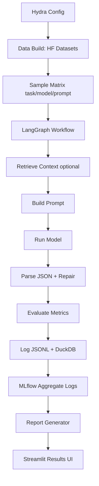

# foundation-model-eval-harness

Config-driven evaluation harness for foundation models on biomedical downstream tasks, with strict structured outputs, experiment tracking, reproducible runs, and a browsable results UI.

## Dashboard (Hugging Face Space)

The Streamlit dashboard shows:

- Leaderboard metrics by task, model, and prompt version
- Parse-validity and latency trends from run artifacts
- Sample-level rows and qualitative examples (input/output/parsed metrics)

Demo data for Space startup is bundled in:

- `space_assets/runs/baseline_models/`
- `space_assets/runs/rag_baseline/`
- `space_assets/runs/smoke_ci/`

Run-selection behavior:

- Prefer `baseline_models` if available
- Else prefer `rag_baseline`
- Else prefer `smoke_ci`
- Else choose the newest discovered run

The dashboard searches run artifacts in both:

- `./runs`
- `./space_assets/runs`

Local dashboard run:

```bash
python -m streamlit run app.py
```

## What This Solves

This repository provides a repeatable way to compare foundation models and prompt versions across multiple NLP tasks while preserving full run traceability:

- Per-sample logs in JSONL and DuckDB
- Strict schema validation and parse error handling
- Metric tables by task × model × prompt version
- Automated error analysis and report generation
- MLflow tracking with local artifacts
- Optional retrieval-augmented baseline

## Quickstart

```bash
make setup
make data
make run EXP=baseline_models
make report EXP=baseline_models
make serve
```

Outputs are stored in `runs/<exp_name>/`:

- `results.duckdb`: analytics database
- `preds.jsonl`: per-sample execution log
- `config_resolved.yaml`: resolved run configuration
- `report.html` and `report.md`: generated report
- `artifacts/`: plot images
- `mlruns/`: local MLflow tracking store

## Architecture



## Tasks, Datasets, Metrics

### Tasks

- Summarization
- Structured extraction (JSON)
- Classification (yes/no/maybe)

### Datasets

- `qiaojin/PubMedQA` (`pqa_labeled`) for classification + summarization-style inputs
- `cvlt-mao/bc5cdr` for extraction (diseases, chemicals)

### Metrics

- Summarization: ROUGE-L, BERTScore (best-effort), output length, compression ratio
- Classification: accuracy, per-sample macro-F1 signal
- Extraction: entity-level precision/recall/F1, exact match
- Validation/error: schema validity rate, parse error rates, empty output checks

## Repo Layout

```text
foundation-model-eval-harness/
  README.md
  pyproject.toml
  uv.lock
  Makefile
  .env.example
  .gitignore
  docker/
    Dockerfile
  .github/
    workflows/ci.yml
  configs/
    default.yaml
    experiments/
      baseline_models.yaml
      rag_baseline.yaml
      ablation_prompts.yaml
  src/
    fmeh/
      __init__.py
      cli.py
      config.py
      data/
        build_datasets.py
        schemas.py
      models/
        registry.py
        hf_local.py
        openai_api.py
      prompts/
        templates.py
        versions/
          v1.yaml
          v2.yaml
      graph/
        state.py
        nodes.py
        build_graph.py
      eval/
        metrics.py
        validators.py
        judge.py
      logging/
        mlflow_logger.py
        duckdb_logger.py
      reporting/
        make_report.py
        plots.py
      rag/
        index.py
        retriever.py
  data/
    raw/
    processed/
  runs/
  app/
    streamlit_app.py
  tests/
    test_parsing.py
    test_metrics.py
    test_graph_smoke.py
```

## CLI

```bash
# Build dataset artifacts
fmeh data build --experiment baseline_models

# Run experiment
fmeh run --experiment baseline_models

# Build report from run folder
fmeh report --run-dir runs/baseline_models

# Launch streamlit browser
fmeh serve --run-dir runs --port 8501
```

## Config-Driven Experiments

Experiment files live in `configs/experiments/`.

- `baseline_models.yaml`: multiple baseline models
- `ablation_prompts.yaml`: prompt version ablations
- `rag_baseline.yaml`: retrieval ON baseline
- `smoke_ci.yaml`: tiny mock run for CI

`configs/default.yaml` contains shared defaults (seed, datasets, generation params, paths).

## Reproducibility

Reproducibility is guaranteed by:

- fixed `seed`
- deterministic task sampling per run config
- resolved config snapshot (`config_resolved.yaml`) saved per run
- explicit experiment YAMLs

## Add A New Model

1. Add entry in `src/fmeh/models/registry.py`.
2. Use existing runner type (`hf_local`) or implement a new runner.
3. Add model id to experiment YAML.

## Add A New Task

1. Extend unified data schema in dataset builder.
2. Add a Pydantic output schema in `src/fmeh/data/schemas.py`.
3. Add task prompt in `src/fmeh/prompts/versions/*.yaml`.
4. Add parsing + metrics logic in graph/eval modules.

## CI + Quality

- `pre-commit` with Ruff/Black/isort
- GitHub Actions workflow for lint, tests, and smoke run
- Dockerfile for reproducible container execution

## Limitations

- CPU-only local baseline models can be slow.
- BC5CDR normalization is mention-string based.
- BERTScore may be skipped if metric backend is unavailable.
- Summarization references are weakly supervised when no direct gold summary is present.

## Next Steps

- Add richer calibration and uncertainty metrics
- Add stronger prompt repair and constrained decoding
- Extend RAG with recall@k against explicit relevance labels
- Add model cost and token pricing analytics
